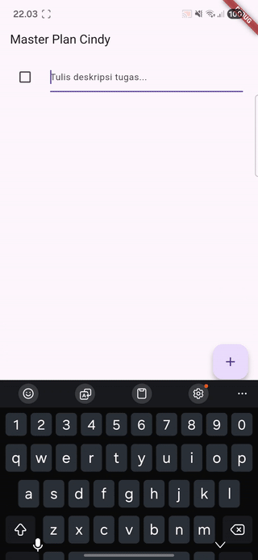
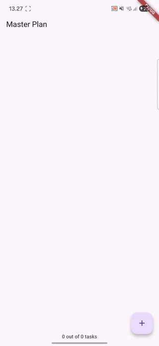
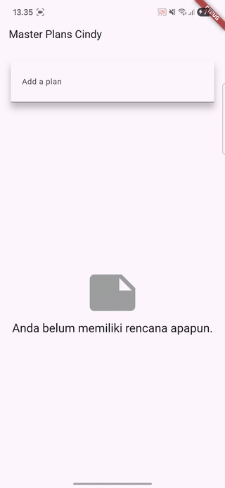
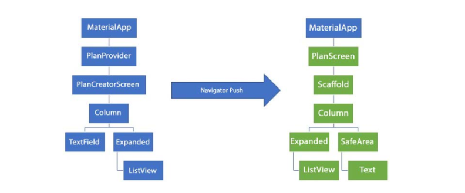

# Laporan Praktikum Pemrograman Mobile
# Pertemuan 10 Dasar State Management

 <b>Nama : Cindy Laili Larasati 
 Nim : 2341720038 
 Kelas : TI - 3F</b> 

 <b>Praktikum 1</b> 

<b>Dasar State dengan Model-View</b>

Hasil:

 <b>Tugas Praktikum 1</b> 

2. Jelaskan maksud dari langkah 4 pada praktikum tersebut! Mengapa dilakukan demikian?

jawab: Langkah 4 membuat file data_layer.dart yang berfungsi untuk mengekspor semua model seperti plan.dart dan task.dart, supaya saat ingin menggunakannya di file lain, proses import jadi lebih singkat dan lebih rapi.

3. Mengapa perlu variabel plan di langkah 6 pada praktikum tersebut? Mengapa dibuat konstanta ?

jawab: Variabel plan dipakai untuk menyimpan daftar tugas, yang menjadi state utama aplikasi. Variabel ini dibuat const supaya punya nilai awal yang tetap dan lebih efisien sebelum diubah melalui setState().

5. Apa kegunaan method pada Langkah 11 dan 13 dalam lifecyle state ?

jawab:

initState() → dijalankan sekali saat widget pertama kali dibuat, digunakan untuk menginisialisasi ScrollController.

dispose() → dijalankan saat widget dihapus, berfungsi untuk membersihkan controller supaya tidak terjadi memory leak.

 <b>Praktikum 2</b> 

<b>Mengelola Data Layer dengan InheritedWidget dan InheritedNotifier</b>

Hasil:

 <b>Tugas Praktikum 2</b> 

2. Jelaskan mana yang dimaksud InheritedWidget pada langkah 1 tersebut! Mengapa yang digunakan InheritedNotifier?

jawab:

InheritedWidget yang dimaksud terdapat pada class PlanProvider yang merupakan turunan dari InheritedNotifier ValueNotifier. Widget ini digunakan untuk membagikan data (Plan) ke seluruh widget turunannya dalam pohon widget Flutter tanpa perlu mengirim data melalui konstruktor secara manual. Penggunaan InheritedNotifier dipilih karena state aplikasi disimpan dalam ValueNotifier, sehingga setiap kali nilai ValueNotifier berubah, widget turunannya akan otomatis melakukan rebuild. Hal ini membuatnya lebih efisien dibanding InheritedWidget biasa yang memerlukan pemanggilan setState() secara manual.

3. Jelaskan maksud dari method di langkah 3 pada praktikum tersebut! Mengapa dilakukan demikian?

jawab: Fungsi ini dipakai untuk menghitung berapa banyak tugas yang sudah selesai dan menampilkan pesan progres, misalnya “2 dari 5 tugas”. Tujuannya agar status kemajuan rencana (Plan) bisa ditampilkan secara dinamis di antarmuka pengguna.

 <b>Praktikum 3</b> 

<b>Membuat State di Multiple Screens</b>

Hasil:

 <b>Tugas Praktikum 3</b> 

2. Berdasarkan Praktikum 3 yang telah Anda lakukan, jelaskan maksud dari gambar diagram berikut ini!

jawab: Gambar sebelah kiri (biru) menunjukkan struktur widget saat aplikasi berada di halaman utama (PlanCreatorScreen), di mana pengguna bisa menambahkan daftar rencana (plan). Pada halaman ini, MaterialApp berfungsi sebagai root aplikasi, PlanProvider menjadi pembungkus data global menggunakan InheritedNotifier, dan PlanCreatorScreen menampilkan TextField untuk input plan serta ListView untuk menampilkan daftar plan. Sementara itu, gambar sebelah kanan (hijau) memperlihatkan kondisi setelah pengguna memilih salah satu plan; aplikasi menavigasi ke halaman baru (PlanScreen) menggunakan Navigator.push. Di halaman ini, PlanScreen menampilkan daftar tugas (Task) dari plan yang dipilih, dengan ListView untuk menampilkan daftar tugas dan Text untuk menampilkan progres secara dinamis.

