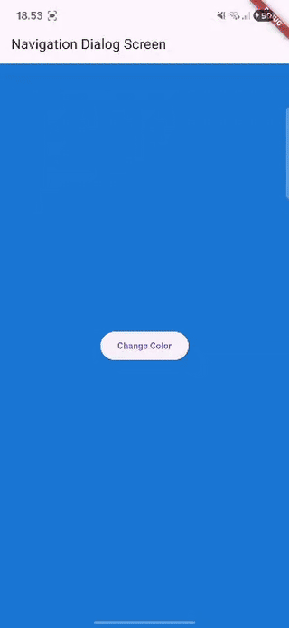

# Laporan Praktikum Pemrograman Mobile
# Pertemuan 11 Pemrograman Asynchronous

 <b>Nama : Cindy Laili Larasati 
 Nim : 2341720038 
 Kelas : TI - 3F</b> 

 <b>Praktikum 1</b> 

<b>Mengunduh Data dari Web Service (API)</b>

Hasil:

Soal 3

Jelaskan maksud kode langkah 5 tersebut terkait substring dan catchError!

jawab: Kode pada langkah 5 berfungsi sebagai pengelola hasil akhir pengambilan data. Apabila data berhasil diambil, ia akan memotong konten hanya menjadi 450 karakter pertama menggunakan substring sebelum ditampilkan. Jika terjadi kegagalan (misalnya karena masalah jaringan), catchError akan mengambil alih, mengganti data yang gagal dengan pesan kesalahan untuk memastikan aplikasi tidak berhenti tiba-tiba.

 <b>Praktikum 2</b> 

<b>Menggunakan await/async untuk menghindari callbacks</b>

Hasil:

Soal 4

Jelaskan maksud kode langkah 1 dan 2 tersebut!

jawab: Kode pada Langkah 1 dan 2 ini merupakan demonstrasi tentang bagaimana menangani operasi yang membutuhkan waktu lama (asinkron) dalam Dart. Tiga fungsi di Langkah 1 (returnOneAsync, dst.) sengaja dibuat untuk mensimulasikan delay selama 3 detik sebelum mengembalikan angka. Kemudian, fungsi count() di Langkah 2 bertugas menjumlahkan hasil dari ketiganya secara berurutan. Karena setiap pemanggilan diawali dengan kata kunci await, fungsi count() dipaksa untuk menunggu setiap fungsi 3 detik selesai sebelum melanjutkan ke yang berikutnya. Jadi, total waktu yang dibutuhkan untuk menyelesaikan count() adalah sekitar 9 detik, di mana hasil akhirnya (total = 6) baru digunakan untuk memperbarui tampilan melalui setState().

 <b>Praktikum 3</b> 

<b>Menggunakan Completer di Future</b>

Hasil:

Soal 5

Jelaskan maksud kode langkah 2 tersebut!

jawab: Kode pada langkah 2 menggunakan Completer untuk mengelola future secara manual. Fungsi getNumber() mengembalikan janji (Future) dan langsung memanggil calculate(). Setelah simulasi penundaan 5 detik di calculate(), baris completer.complete(42) akan menepati janji tersebut dan mengirimkan nilai 42 ke future yang menunggu.

Soal 6

Jelaskan maksud perbedaan kode langkah 2 dengan langkah 5-6 tersebut!

jawab: Perbedaannya adalah pada kesiapan menghadapi kegagalan. Kode awal (Langkah 2) hanya disiapkan untuk skenario sukses (completer.complete(42)). Sementara itu, kode yang dimodifikasi (Langkah 5-6) jauh lebih handal karena menggunakan blok try-catch di fungsi calculate(). Jika terjadi kesalahan, ia akan secara eksplisit mengirimkan sinyal kegagalan melalui completer.completeError(). Sinyal ini kemudian ditangkap oleh blok .catchError(), memungkinkan aplikasi menampilkan notifikasi kesalahan yang terstruktur kepada pengguna.

Hasil:

 <b>Praktikum 4</b> 

<b>Memanggil Future secara paralel</b>

Hasil:

Soal 8

Jelaskan maksud perbedaan kode langkah 1 dan 4!

jawab: Perbedaannya adalah penggunaan method untuk menjalankan tugas asinkron secara paralel. Langkah 1 menggunakan FutureGroup (kemungkinan class eksternal) untuk mengelompokkan dan menunggu ketiga fungsi asinkron selesai secara bersamaan (paralel), sehingga total waktu tunggu hanya 3 detik. Sementara itu, Langkah 4 menunjukkan cara yang standar dan native Dart, yaitu menggunakan Future.wait().

Hasil:

 <b>Praktikum 5</b> 

<b>Menangani Respon Error pada Async Code</b>

Hasil:

Soal 10

Jelaskan maksud perbedaan kode langkah 1 dan 4!

jawab: Setelah memanggil handleError(), hasilnya adalah pesan error spesifik ("Something terrible happened!") muncul di layar, dan "complete" tercetak di konsol. Perbedaan utama kode terletak pada penanganan error: Langkah 1 menggunakan callback .catchError() secara eksternal pada future. Sedangkan Langkah 4 menggunakan sintaks try-catch-finally secara internal di dalam fungsi async. Metode Langkah 4 ini lebih rapi karena mampu menangkap exception dan memastikan kode di blok finally selalu berjalan, terlepas dari hasil sukses atau gagal.

Hasil:

 <b>Praktikum 6</b> 

<b>Menggunakan Future dengan StatefulWidget</b>

Hasil:

Soal 12

Apakah Anda mendapatkan koordinat GPS ketika run di browser? Mengapa demikian?

jawab: Ya, saya mendapatkan koordinat GPS saat run di browser. Alasannya karena plugin geolocator itu cerdas; ketika aplikasi berjalan di web, ia beralih memanfaatkan API Geolocation HTML5 yang memang sudah menjadi fitur bawaan semua browser modern. Jadi, plugin tersebut tidak memerlukan izin sistem operasi handphone, melainkan hanya meminta izin kepada browser melalui pop-up standar. Begitu izin diberikan, browser akan meneruskan data koordinat lokasi tersebut langsung ke aplikasi Flutter saya.

Hasil:

 <b>Praktikum 7</b> 

<b>Manajemen Future dengan FutureBuilder</b>

Hasil:

Soal 13

Apakah ada perbedaan UI dengan praktikum sebelumnya? Mengapa demikian?

jawab: saat kode diubah menggunakan FutureBuilder, terdapat perbedaan UI karena FutureBuilder mengambil alih manajemen state asinkron secara otomatis. Sebelum ini, loading dikelola secara manual; sekarang, FutureBuilder secara reaktif menampilkan indikator loading (CircularProgressIndicator) saat future (position) masih dalam status waiting, dan baru menampilkan data lokasi setelah proses selesai, semua dilakukan tanpa setState manual di awal.

Soal 14

Apakah ada perbedaan UI dengan langkah sebelumnya? Mengapa demikian?

jawab: penambahan logic snapshot.hasError tidak akan menimbulkan perbedaan UI selama pengambilan lokasi berlangsung normal. Perubahan ini hanyalah mekanisme pertahanan yang memastikan jika future gagal (misalnya gagal koneksi atau izin lokasi ditolak), aplikasi tidak crash tetapi justru menampilkan pesan notifikasi error yang jelas ("Terjadi error, coba lagi nanti!") kepada pengguna, meningkatkan stabilitas dan user experience aplikasi.

 <b>Praktikum 8</b> 

<b>Navigation route dengan Future Function</b>

Hasil:

Soal 16

Cobalah klik setiap button, apa yang terjadi ? Mengapa demikian ?

jawab: Saat tombol di Layar diklik, Layar Kedua tertutup dan Layar Pertama akan seketika berganti warna sesuai pilihan tombol. Mekanisme ini terjadi karena Layar Pertama menunggu (await Navigator.push) hasil dari Layar Kedua. Setiap tombol di Layar Kedua mengirimkan nilai warna saat menutup dirinya (Navigator.pop(context, color)), dan warna tersebut langsung digunakan oleh Layar Pertama untuk update tampilannya.

 <b>Praktikum 9</b> 

<b>Navigation route dengan Future Function</b>

Hasil:

Soal 17

Cobalah klik setiap button, apa yang terjadi ? Mengapa demikian ?

jawab: Saat tombol "Change Color" diklik, sebuah dialog muncul. Ketika salah satu tombol warna di dalam dialog dipilih, dialog tersebut menutup diri sambil mengirimkan nilai warna (Navigator.pop(context, color)). Di layar utama, perintah await showDialog menangkap warna tersebut, dan setState() langsung memperbarui variabel warna state, menyebabkan latar belakang layar utama berubah warna seketika.

