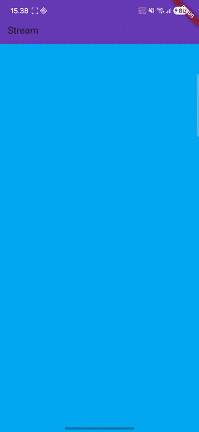
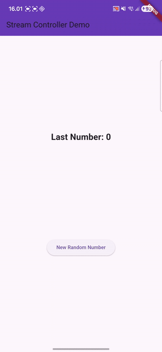
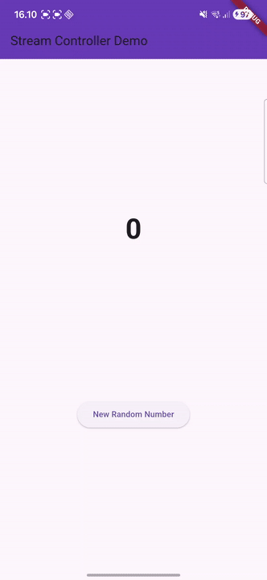
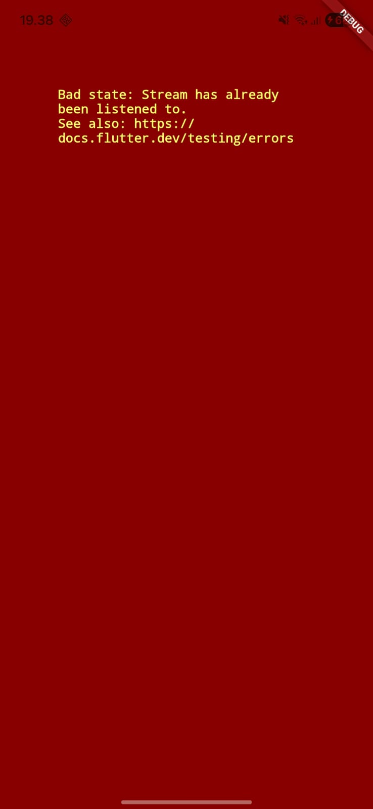
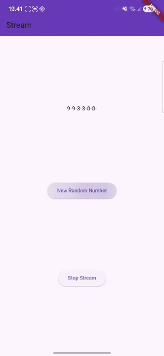
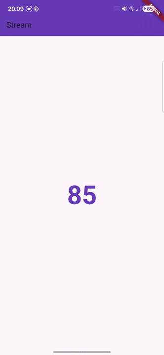
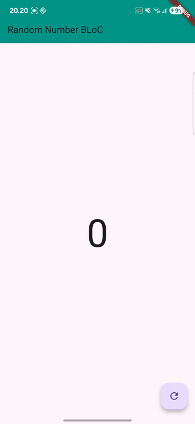

# Laporan Praktikum Pemrograman Mobile
# Pertemuan 12 Lanjutan State Management dengan Streams

 <b>Nama : Cindy Laili Larasati 
 Nim : 2341720038 
 Kelas : TI - 3F</b> 

 <b>Praktikum 1</b> 

<b>Dart Streams</b>

Hasil:

Soal 3

Jelaskan fungsi keyword yield* pada kode tersebut!

jawab: Keyword yield* digunakan untuk mendelegasikan seluruh proses pengiriman data dan kejadian dari satu Stream ke Stream yang sedang didefinisikan.

Apa maksud isi perintah kode tersebut?

jawab: Parameter t itu pada dasarnya adalah hitungan detik. Rumus modulus (%) pada baris int index = t % colors.length; dipakai untuk reset indeks warna. Tujuannya supaya saat semua warna sudah dipakai, kita bisa mengulang urutan warna dari daftar colors secara looping. Jadi, background aplikasinya akan berganti-ganti warna setiap detik sesuai urutan yang kita kasih.

Soal 5

Jelaskan perbedaan menggunakan listen dan await for (langkah 9) !

jawab: 

- await for digunakan di dalam fungsi yang dideklarasikan sebagai async, dan memiliki fungsi untuk menerima dan memproses data yang mengalir dari sebuah stream secara berurutan.

- listen() digunakan untuk mendaftarkan fungsi respons (callback) yang akan dieksekusi secara otomatis setiap kali stream menghasilkan data (event) baru.

 <b>Praktikum 2</b> 

<b>Stream controllers dan sinks</b>

Hasil:

Soal 6

Jelaskan maksud kode langkah 8 dan 10 tersebut!

jawab: 

- Langkah 8: Pada tahap ini, fungsi utamanya adalah menyiapkan saluran data. Aplikasi membuat instance dari NumberStream dan mengakses stream controller-nya. Kemudian, kita mendaftarkan listener (pelanggan) untuk stream tersebut. Setiap kali event data baru tiba, fungsi setState() akan dieksekusi untuk memperbarui variabel lastNumber. Dengan kata lain, langkah ini adalah titik di mana saluran data stream dihubungkan secara aktif ke user interface (UI) aplikasi.

- Langkah 10: Metode ini berfungsi sebagai pemicu event. Pertama, ia menggunakan class Random() untuk menghasilkan nilai integer acak (antara 0 hingga 9). Selanjutnya, nilai yang dihasilkan tersebut dimasukkan (sink) ke dalam stream melalui panggilan addNumberToSink(). Efeknya, setiap penekanan tombol akan menyuntikkan data baru ke dalam stream, yang kemudian akan diambil dan ditampilkan di UI oleh listener yang sudah kita pasang di initState().

Soal 7

Jelaskan maksud kode langkah 13 sampai 15 tersebut!

jawab: 

- Langkah 13: Perluasan pada class NumberStream dilakukan dengan menyertakan method addError(). Fungsi spesifik dari method ini adalah menyediakan saluran resmi untuk mengirimkan event kesalahan ke dalam stream melalui perintah controller.sink.addError(). Dengan demikian, stream kita kini memiliki kapabilitas untuk mengeluarkan notifikasi error, bukan hanya data angka.

- Langkah 14: Pada fungsi initState(), kita wajib menambahkan handler onError pada listener stream yang telah dibuat. Ketika stream mengirimkan event error, kode di dalam onError() akan segera dieksekusi, dan dalam kasus ini, ia akan mengatur nilai lastNumber menjadi $-1$. Langkah ini sangat krusial untuk menjaga responsivitas user interface (UI) dan memberikan umpan balik visual yang jelas kepada pengguna bahwa terjadi masalah pada aliran data.

- Langkah 15: Method addRandomNumber() dimodifikasi secara fungsional. Ia tidak lagi bertugas menghasilkan dan mengirim data angka acak, melainkan diubah untuk mengirimkan event error secara eksplisit dengan memanggil addError(). Modifikasi ini bertujuan sebagai mekanisme uji coba untuk memverifikasi apakah sistem penanganan error (onError di Langkah 14) kita berfungsi dengan benar dan mampu merespons gangguan dari stream.

 <b>Praktikum 3</b> 

<b>Injeksi data ke streams</b>

Hasil:

Soal 8

Jelaskan maksud kode langkah 1-3 tersebut!

jawab: 

- Langkah 1: Kita menggunakan StreamTransformer<int, int> untuk memodifikasi data yang lagi "mengalir" di stream sebelum datanya sampai ke UI. Deklarasi <int, int> di sini artinya stream ini memasukkan data tipe integer dan mengeluarkan data tipe integer juga. Jadi, transformer ini fungsinya seperti filter atau middleware yang mengubah nilai angka sebelum ditampilkan.

- Langkah 2: Di dalam fromHandlers, terdapat tiga fungsi utama yang mengatur alur data di StreamTransformer: handleData bertugas memproses data asli (misalnya mengalikan nilai dengan 10) sebelum meneruskannya (sink) ke stream berikutnya. handleError berfungsi sebagai protokol penanganan kesalahan dengan cara mengubah notifikasi error menjadi data -1 sebagai penanda visual. Terakhir, handleDone memastikan bahwa saluran keluar (sink) ditutup secara otomatis setelah stream sumber selesai mengirimkan seluruh data.

- Langkah 3: Kita pasang listener pada stream.transform(transformer). Karena listener dipasang setelah transformer, UI kita sekarang hanya menerima data yang sudah diolah. Misalnya, stream aslinya ngirim angka 3, tapi UI bakal nerima 30. Kalau terjadi error, lastNumber akan berubah jadi -1 karena transformer sudah mengubah event error menjadi data angka -1.

 <b>Praktikum 4</b> 

<b>Subscribe ke stream events</b>

Hasil:

Soal 9

Jelaskan maksud kode langkah 2, 6 dan 8 tersebut!

jawab: 

- Langkah 2: Pada langkah ini, kita mengaktifkan proses pelangganan (subscription) ke stream dengan menggunakan metode .listen(). Subscription ini berperan sebagai pendengar aktif yang bertugas menerima setiap event data baru yang dipancarkan oleh stream. Begitu data diterima, setState() dipanggil untuk memperbarui variabel dan menampilkan data tersebut secara langsung di user interface (UI).

- Langkah 6: Di dalam method dispose(), tindakan krusial dilakukan dengan memanggil subscription.cancel(). Fungsi dari cancel() adalah untuk menghentikan secara paksa proses mendengarkan stream segera setelah widget dihancurkan atau dikeluarkan dari tampilan. Tujuan utama dari langkah ini adalah pencegahan memory leak, yaitu kondisi di mana stream tetap aktif dan mengonsumsi memori meskipun widget yang menggunakannya sudah tidak ada.

- Langkah 8: Langkah ini menerapkan validasi keamanan dengan melakukan pengecekan if (!numberStreamController.isClosed) sebelum mencoba mengirimkan data baru. Pengecekan ini bertujuan untuk mencegah runtime error yang terjadi ketika aplikasi mencoba menambahkan data ke stream yang sudah ditutup (closed). Dengan demikian, kita memastikan bahwa pengiriman data hanya dilakukan pada saluran data (stream) yang masih berstatus aktif.

 <b>Praktikum 5</b> 

<b>Subscribe ke stream events</b>

Hasil:

Soal 10

Jelaskan mengapa error itu bisa terjadi ?

jawab: 

Error tersebut ("Bad state: Stream has already been listened to") terjadi karena, secara bawaan (default), Stream di Dart itu cuma bisa punya satu pendengar (single-subscription stream). Artinya, hanya satu subscriber (atau listener) yang diizinkan untuk mengambil data dari saluran stream tersebut. Ketika mencoba membuat langganan kedua ke stream yang sama, Dart langsung menolaknya karena aturan itu sudah dilanggar.

Soal 11

Jelaskan mengapa hal itu bisa terjadi ?

jawab: 

Stream diubah menjadi Broadcast Stream, yang berarti lebih dari satu pendengar diizinkan. Karena ada dua listener aktif, setiap data baru yang masuk (event) diterima dan diproses oleh keduanya secara bersamaan, sehingga hasil data yang sama ditampilkan dua kali secara berurutan.

 <b>Praktikum 6</b> 

<b>StreamBuilder</b>

Hasil:

Soal 12

Jelaskan maksud kode pada langkah 3 dan 7 !

jawab: 

- Langkah 3: Pada langkah ini, kita mendefinisikan Stream yang akan secara otomatis menghasilkan event data setiap satu detik (periodic). Proses ini menggunakan Stream.periodic() yang dikombinasikan dengan yield*. Fungsinya adalah membuat aliran data angka acak (dari 0 hingga 9) yang terus menerus mengalir tanpa perlu dipicu secara manual.

- Langkah 7: Kita menggunakan widget StreamBuilder untuk menghubungkan Stream langsung ke user interface (UI). StreamBuilder ini bertugas mendengarkan Stream secara terus-menerus. Keunggulannya adalah sifatnya yang reaktif; setiap kali ada data baru yang masuk ke Stream, StreamBuilder akan memanggil ulang fungsi builder dan secara otomatis memperbarui tampilan teks di layar dengan nilai angka terbaru.

 <b>Praktikum 7</b> 

<b>BLoC Pattern</b>

Hasil:

Soal 13

Jelaskan maksud praktikum ini ! Dimanakah letak konsep pola BLoC-nya ?

jawab: 

Praktikum ini intinya menunjukkan bagaimana caranya kita memisahkan logika bisnis (yaitu proses generate angka acak) dari tampilan (user interface). Konsep BLoC (Business Logic Component) di sini diwakili oleh file random_bloc.dart, yang jadi pusat kendali; dia mengurus semua input (event) dan output (stream data). Kita pakai StreamController sebagai jembatan asinkron yang ngelola arus data antar komponen. Jadi, tampilan UI (random_screen.dart) kerjanya gampang: dia hanya nonton stream lewat StreamBuilder dan tidak perlu tahu detail rumit bagaimana angka acaknya diproses di belakang layar.

