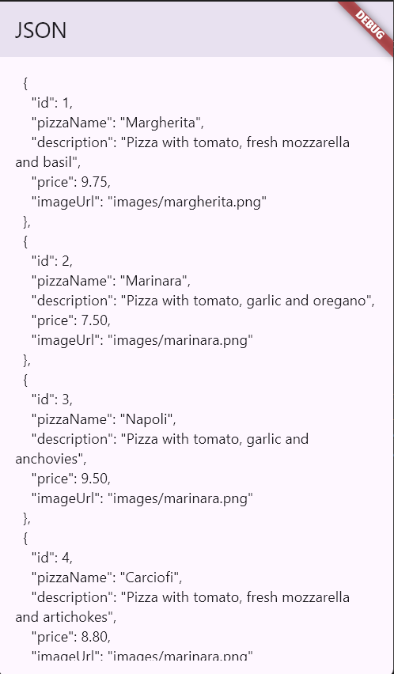
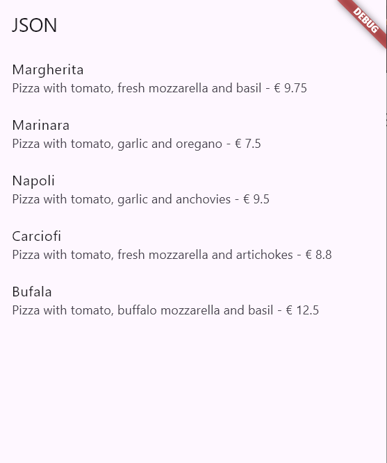
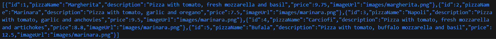
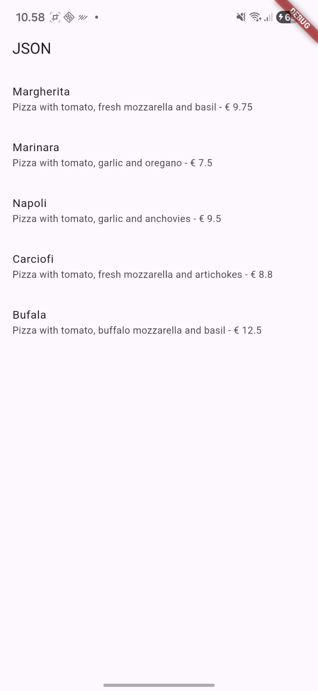
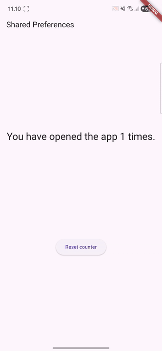
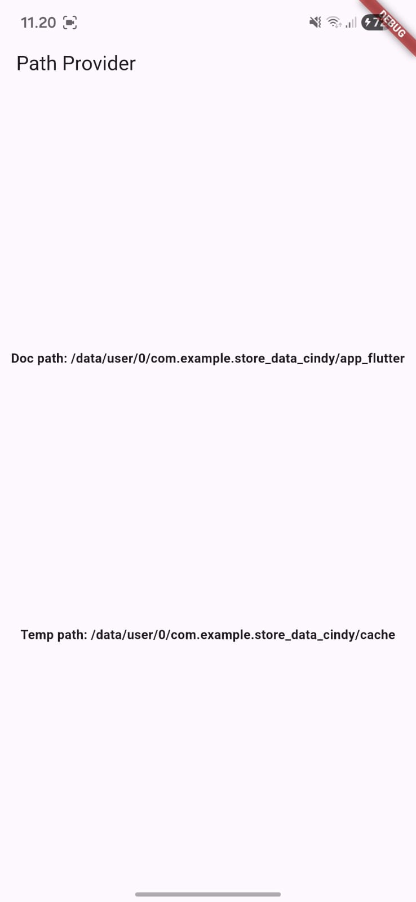
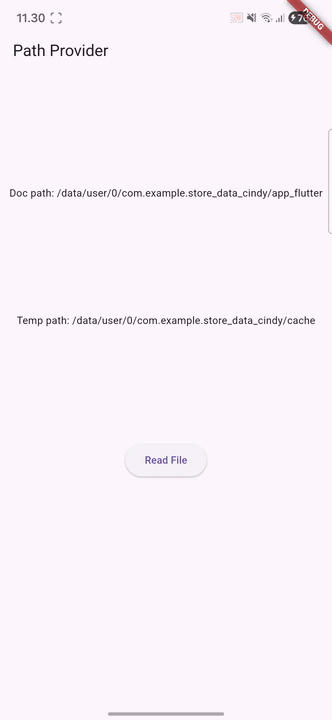
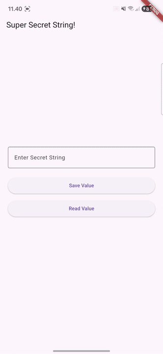

# Laporan Praktikum Pemrograman Mobile
# Pertemuan 13 Persistensi Data

 <b>Nama : Cindy Laili Larasati 
 Nim : 2341720038 
 Kelas : TI - 3F</b> 

 <b>Praktikum 1</b> 

<b>Konversi Dart model ke JSON</b>

Hasil:

Soal 3

 <b>Praktikum 2</b> 

<b>Handle kompatibilitas data JSON</b>

Hasil:

 <b>Praktikum 3</b> 

<b>Menangani error JSON</b>

Hasil:

Soal 5

Jelaskan maksud kode lebih safe dan maintainable!

jawab: 

Menggunakan konstanta seperti keyId dan keyName itu jauh lebih aman dibanding langsung menulis string seperti 'id' atau 'pizzaName'. Karena, semua kunci JSON punya satu sumber yang pasti, jadi kecil kemungkinan terjadi typo yang susah dilacak. Kalau pun salah, IDE bisa langsung kasih tahu saat kompilasi. Selain itu, kode juga lebih gampang dirawat karena kalau suatu saat struktur JSON berubah, cukup ubah nama konstanta di satu tempat saja, dan semua fungsi seperti fromJson dan toJson otomatis ikut menyesuaikan.

 <b>Praktikum 4</b> 

<b>Shared Preferences</b>

Hasil:

 <b>Praktikum 5</b> 

<b>Akses filesystem dengan path_provider</b>

Hasil:

 <b>Praktikum 6</b> 

<b>Akses filesystem dengan direktori</b>

Hasil:

 <b>Praktikum 7</b> 

<b>Menyimpan data dengan enkripsi/dekripsi</b>

Hasil:

