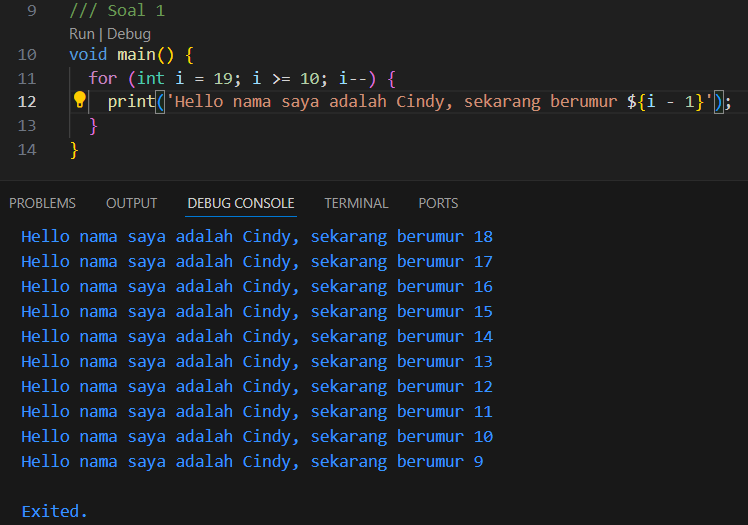

# Laporan Praktikum Pemrograman Mobile

 <b>Nama : Cindy Laili Larasati 
 Nim : 2341720038 
 Kelas : TI - 3F</b> 

 Soal 1 

Modifikasilah kode pada baris 3 di VS Code atau Editor Code favorit Anda berikut ini agar mendapatkan keluaran (output) sesuai yang diminta!

jawab:

 Soal 2 

Mengapa sangat penting untuk memahami bahasa pemrograman Dart sebelum kita menggunakan framework Flutter ? Jelaskan!

jawab:

Penting memahami bahasa Dart sebelum menggunakan Flutter karena:

- Flutter dibangun menggunakan Dart, sehingga semua kode aplikasi Flutter ditulis dalam Dart.

- Memahami Dart memudahkan dalam memahami struktur, sintaks, dan konsep dasar pemrograman di Flutter.

- Fitur-fitur seperti Null Safety, async/await, dan OOP di Dart sangat sering digunakan dalam pengembangan aplikasi Flutter.

- Dengan menguasai Dart, proses debugging dan pengembangan aplikasi menjadi lebih efisien.

 Soal 3 

Rangkumlah materi dari codelab ini menjadi poin-poin penting yang dapat Anda gunakan untuk membantu proses pengembangan aplikasi mobile menggunakan framework Flutter.

jawab:

Poin-poin penting dari codelab ini untuk pengembangan aplikasi Flutter:

- Dart adalah bahasa utama untuk Flutter, pelajari sintaks dan fitur dasarnya.

- Struktur program Dart: fungsi main(), variabel, tipe data, dan kontrol alur (if, for, while).

- Null Safety: mencegah error akibat nilai null yang tidak diharapkan.

- Penggunaan package dan library untuk memperluas fitur aplikasi.

- Pemahaman widget sebagai komponen utama UI di Flutter.

- Cara menjalankan dan men-debug aplikasi Flutter.

 Soal 4 

Buatlah penjelasan dan contoh eksekusi kode tentang perbedaan Null Safety dan Late variabel !

jawab:

Null Safety memastikan variabel tidak bernilai null kecuali diizinkan secara eksplisit.

Late variabel digunakan untuk mendeklarasikan variabel yang akan diinisialisasi nanti, tetapi pasti sebelum digunakan.

Contoh Null Safety:

String name = 'Cindy'; // Tidak bisa null

String? nickname; // Bisa null

print(name); // Output: Cindy

print(nickname); // Output: null

Contoh Late variabel:

late String greeting;

reeting = 'Hello, Dart!';

print(greeting); // Output: Hello, Dart!
