# Laporan Praktikum Pemrograman Mobile
# Pertemuan 4 Collection, Records, dan Functions di Dart

<br><b>Nama : Cindy Laili Larasati<br>
<br>Nim : 2341720038<br>
<br>Kelas : TI - 3F</b><br>

<hr>

<br><b>Praktikum 1</b><br>
<p><b>Eksperimen Tipe Data List</b></p>

<p>Langkah 1:</p>

```
var list = [1, 2, 3];
assert(list.length == 3);
assert(list[1] == 2);
print(list.length);
print(list[1]);

list[1] = 1;
assert(list[1] == 1);
print(list[1]);
```

<p>Langkah 2:</p>
<p>Silakan coba eksekusi (Run) kode pada langkah 1 tersebut. Apa yang terjadi? Jelaskan!</p>
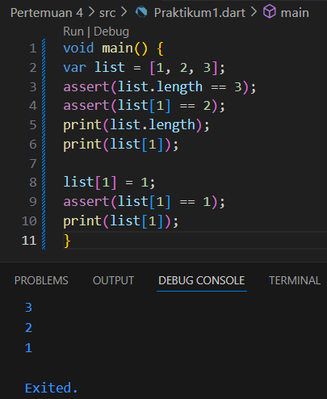
<p>Program berjalan tanpa error, karena semua assert bernilai benar.</p>

<p>Langkah 3:</p>
<p>Ubah kode pada langkah 1 menjadi variabel final yang mempunyai index = 5 dengan default value = null. Isilah nama dan NIM Anda pada elemen index ke-1 dan ke-2. Lalu print dan capture hasilnya.

Apa yang terjadi ? Jika terjadi error, silakan perbaiki.</p>
<p>jawab:</p>
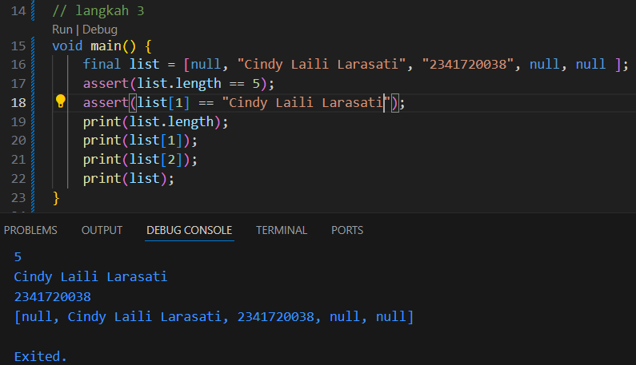

<hr>

<br><b>Praktikum 2</b><br>
<p><b>Eksperimen Tipe Data Set</b></p>

<p>Langkah 1:</p>

```
var halogens = {'fluorine', 'chlorine', 'bromine', 'iodine', 'astatine'};
print(halogens);
```

<p>Langkah 2:</p>
<p>Silakan coba eksekusi (Run) kode pada langkah 1 tersebut. Apa yang terjadi? Jelaskan! Lalu perbaiki jika terjadi error.</p>
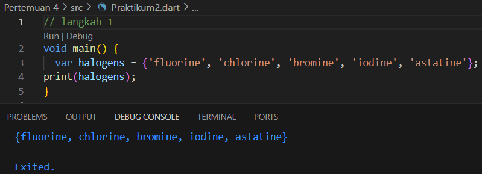
<p>kode tersebut berjalan tanpa error karena Dart mengenali kurung kurawal sebagai set, sehingga variabel halogens menyimpan sekumpulan nilai unik. Saat dijalankan, hasilnya akan menampilkan isi set, hanya saja urutannya tidak selalu sama karena set tidak menjamin urutan elemen.</p>

<p>Langkah 3:</p>
<p>Tambahkan kode program berikut, lalu coba eksekusi (Run) kode Anda.</p>

```
var names1 = <String>{};
Set<String> names2 = {}; // This works, too.
var names3 = {}; // Creates a map, not a set.

print(names1);
print(names2);
print(names3);
```

<p>Apa yang terjadi ? Jika terjadi error, silakan perbaiki namun tetap menggunakan ketiga variabel tersebut. Tambahkan elemen nama dan NIM Anda pada kedua variabel Set tersebut dengan dua fungsi berbeda yaitu .add() dan .addAll(). Untuk variabel Map dihapus, nanti kita coba di praktikum selanjutnya.</p>

<p>jawab :</p>
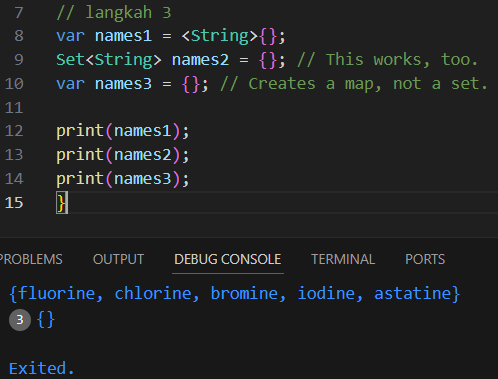
<p>Program tidak menghasilkan error dan outputnya memang muncul seperti pada gambar. Bedanya, `names1` dan `names2` bertipe Set, sedangkan `names3` sebenarnya bertipe Map. Jadi meskipun tampilannya mirip, tipe data yang digunakan tidak sama.</p>

<p>setelah diperbaiki:</p>
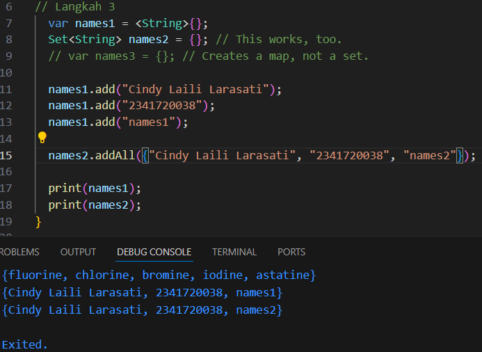

<hr>

<br><b>Praktikum 3</b><br>
<p><b>Eksperimen Tipe Data Maps</b></p>

<p>Langkah 1:</p>

```
var gifts = {
  // Key:    Value
  'first': 'partridge',
  'second': 'turtledoves',
  'fifth': 1
};

var nobleGases = {
  2: 'helium',
  10: 'neon',
  18: 2,
};

print(gifts);
print(nobleGases);
```

<p>Langkah 2:</p>
<p>Silakan coba eksekusi (Run) kode pada langkah 1 tersebut. Apa yang terjadi? Jelaskan! Lalu perbaiki jika terjadi error.</p>
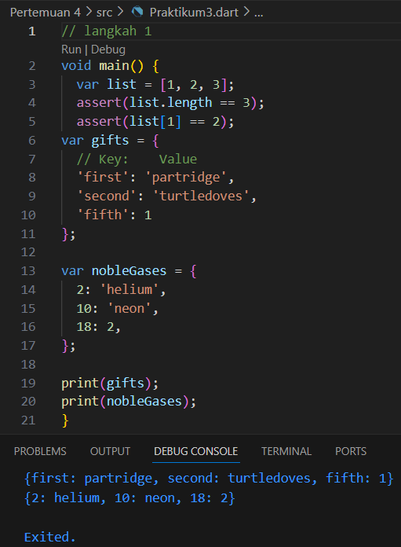
<p>Saat dijalankan tidak muncul error, tetapi dari kode tersebut bisa dipahami bahwa Map di Dart menyimpan data dalam bentuk pasangan key-value. Tipe data untuk key dan value tidak harus sama, sehingga meskipun value berisi campuran String dan int, program tetap dapat dijalankan dengan benar.
</p>

<p>Langkah 3:</p>
<p>Tambahkan kode program berikut, lalu coba eksekusi (Run) kode Anda.</p>

```
var mhs1 = Map<String, String>();
gifts['first'] = 'partridge';
gifts['second'] = 'turtledoves';
gifts['fifth'] = 'golden rings';

var mhs2 = Map<int, String>();
nobleGases[2] = 'helium';
nobleGases[10] = 'neon';
nobleGases[18] = 'argon';
```

<p>Apa yang terjadi ? Jika terjadi error, silakan perbaiki.</p>
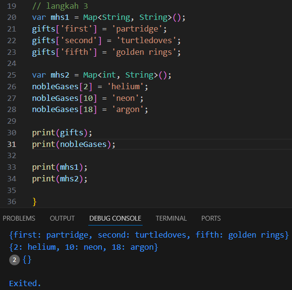
<p>kode tidak menimbulkan error, tetapi mhs1 dan mhs2 tetap kosong karena hanya dibuat sebagai map tanpa pernah diisi data, sehingga saat diprint hasilnya {}.</p>

Tambahkan elemen nama dan NIM Anda pada tiap variabel di atas (gifts, nobleGases, mhs1, dan mhs2).</p>

<p>jawab:</p>

```
var gifts = {
    // Key:    Value
    'first': 'partridge',
    'second': 'turtledoves',
    'fifth': 1,
  };

  var nobleGases = {
    2: 'helium', 
    10: 'neon', 
    18: 2,
    };

  var mhs1 = Map<String, String>();
  gifts['name'] = 'Cindy Laili Larasati';
  gifts['nim'] = '2341720038';

  mhs1['name'] = 'Cindy Laili Larasati';
  mhs1['nim'] = '2341720038';

  var mhs2 = Map<int, String>();
  nobleGases[4] = 'Cindy Laili Larasati';
  nobleGases[5] = '2341720038';

  mhs2[4] = 'Cindy Laili Larasati';
  mhs2[5] = '2341720038';

  print(gifts);
  print(nobleGases);
  print(mhs1);
  print(mhs2);
```

<p>saat dijalankan:</p>
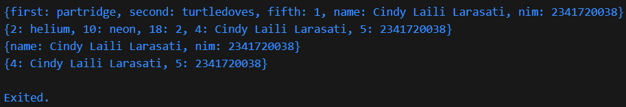

<hr>

<br><b>Praktikum 4</b><br>
<p><b>Eksperimen Tipe Data List: Spread dan Control-flow Operators</b></p>

<p>Langkah 1:</p>

```
var list = [1, 2, 3];
var list2 = [0, ...list];
print(list1);
print(list2);
print(list2.length);
```

<p>Langkah 2:</p>
<p>Silakan coba eksekusi (Run) kode pada langkah 1 tersebut. Apa yang terjadi? Jelaskan! Lalu perbaiki jika terjadi error.</p>
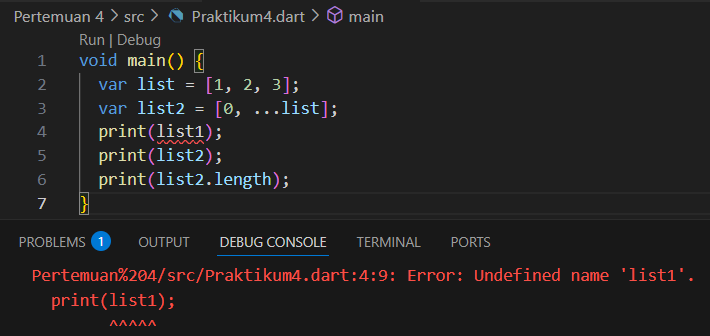
<p>Program akan error karena ada pemanggilan print(list1); padahal variabel list1 tidak didefinisikan—yang tersedia hanya list dan list2.</p>

<p>setelah diperbaiki:</p>
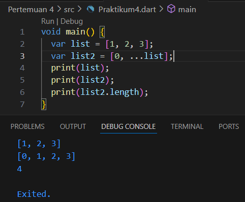

<p>Langkah 3:</p>
<p>Tambahkan kode program berikut, lalu coba eksekusi (Run) kode Anda.</p>

```
list1 = [1, 2, null];
print(list1);
var list3 = [0, ...?list1];
print(list3.length);
```

<p>Apa yang terjadi ? Jika terjadi error, silakan perbaiki.</p>
<p>terjadi error karena varible list1 belum dideklarasikan </p>
<p>setelah diperbaiki:</p>
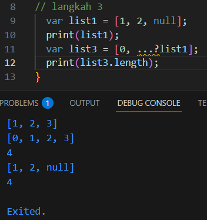

<p>Tambahkan variabel list berisi NIM Anda menggunakan Spread Operators. Dokumentasikan hasilnya dan buat laporannya!</p>

```
  // Menambahkan NIM
  var nim = [2, 3, 4, 1, 7, 2, 0, 0, 3, 8];

  var listNim = [...nim];
  print(listNim);
```

<p>ketika dijalankan:</p>
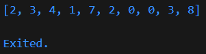

<p>Langkah 4:</p>
<p>Tambahkan kode program berikut, lalu coba eksekusi (Run) kode Anda.</p>

```
var nav = ['Home', 'Furniture', 'Plants', if (promoActive) 'Outlet'];
print(nav);
```

<p>Apa yang terjadi ? Jika terjadi error, silakan perbaiki. Tunjukkan hasilnya jika variabel promoActive ketika true dan false.</p>
<p>jawab:</p>
<p>program akan error karena variabel promoActive belum didefinisikan.</p>

<p>setelah diperbaiki:</p>

```
var promoActive = true;
var nav = ['Home', 'Furniture', 'Plants', if (promoActive) 'Outlet'];
print(nav);
```

<p>ketika dijalankan (True):</p>
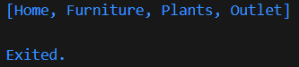

<p>ketika dijalankan (False):</p>
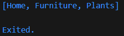

<p>Artinya, elemen Outlet akan muncul di dalam list hanya jika `promoActive` bernilai true, sedangkan jika `promoActive` bernilai false, elemen tersebut tidak akan ditambahkan.</p>

<p>Langkah 5:</p>
<p>Tambahkan kode program berikut, lalu coba eksekusi (Run) kode Anda.</p>

```
var nav2 = ['Home', 'Furniture', 'Plants', if (login case 'Manager') 'Inventory'];
print(nav2);
```

<p>Apa yang terjadi ? Jika terjadi error, silakan perbaiki. Tunjukkan hasilnya jika variabel login mempunyai kondisi lain</p>
<p>jawab:</p>
<p>Program akan error karena bagian if (login case 'Manager') tidak valid.</p>

<p>Jika login = 'Manager':</p>
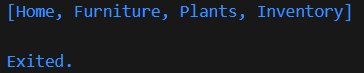

<p>Jika login = 'User':</p>
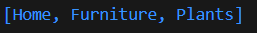

<p>Artinya, `if (login case 'Manager') 'Inventory'` akan menambahkan Inventory ke dalam list hanya ketika nilai `login` sama dengan Manager. Jika nilainya berbeda, maka elemen Inventory tidak ikut masuk ke dalam list.</p>

<p>Langkah 6:</p>
<p>Tambahkan kode program berikut, lalu coba eksekusi (Run) kode Anda.</p>

```
var listOfInts = [1, 2, 3];
var listOfStrings = ['#0', for (var i in listOfInts) '#$i'];
assert(listOfStrings[1] == '#1');
print(listOfStrings);
```

<p>Apa yang terjadi ? Jika terjadi error, silakan perbaiki. Jelaskan manfaat Collection For dan dokumentasikan hasilnya.</p>
<p>jawab:</p>
<p>tidak terjadi error</p>
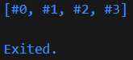

<p>Collection For di Dart memungkinkan kita membentuk list, set, atau map baru dengan menuliskan perulangan langsung di dalam deklarasi. Sebagai contoh, `for (var i in listOfInts) '#$i'` akan menghasilkan elemen-elemen baru sesuai isi `listOfInts`. Dengan teknik ini, kode jadi lebih singkat dan lebih jelas tanpa perlu membuat loop terpisah.</p>

<hr>

<br><b>Praktikum 5</b><br>
<p><b>Eksperimen Tipe Data Records</b></p>

<p>Langkah 1:</p>

```
var record = ('first', a: 2, b: true, 'last');
print(record)
```

<p>Langkah 2:</p>
<p>Silakan coba eksekusi (Run) kode pada langkah 1 tersebut. Apa yang terjadi? Jelaskan! Lalu perbaiki jika terjadi error.</p>
<p>jawab:</p>
<p>Tidak terjadi error</p>
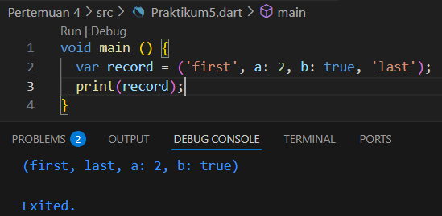

<p>Langkah 3:</p>
<p>Tambahkan kode program berikut di luar scope void main(), lalu coba eksekusi (Run) kode Anda.</p>

```
(int, int) tukar((int, int) record) {
  var (a, b) = record;
  return (b, a);
}
```

<p>Apa yang terjadi ? Jika terjadi error, silakan perbaiki. Gunakan fungsi tukar() di dalam main() sehingga tampak jelas proses pertukaran value field di dalam Records.</p>
<p>jawab:</p>
<p>Tidak muncul error maupun perubahan apa pun, karena fungsi `tukar()` tidak dipanggil di dalam `main()`. Akibatnya, proses pertukaran nilai tidak dijalankan dan output hanya menampilkan isi record seperti semula.</p>

<p>Langkah 4:</p>
<p>Tambahkan kode program berikut di dalam scope void main(), lalu coba eksekusi (Run) kode Anda.</p>

```
// Record type annotation in a variable declaration:
(String, int) mahasiswa;
print(mahasiswa);
```

<p>Apa yang terjadi ? Jika terjadi error, silakan perbaiki. Inisialisasi field nama dan NIM Anda pada variabel record mahasiswa di atas. Dokumentasikan hasilnya dan buat laporannya!</p>
<p>jawab:</p>
<p>Program akan error karena variabel `mahasiswa` yang bertipe record `(String, int)` belum diberi nilai saat dideklarasikan, sehingga dianggap belum diinisialisasi.</p>

<p>setelah diperbaiki:</p>

```
// Record type annotation in a variable declaration:
  (String, int) mahasiswa = ('Cindy Laili Larasati', 2341720038);
  print(mahasiswa);
```

<p>ketika dijalankan:</p>
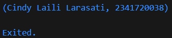

<p>Langkah 5:</p>
<p>Tambahkan kode program berikut di dalam scope void main(), lalu coba eksekusi (Run) kode Anda.</p>

```
var mahasiswa2 = ('first', a: 2, b: true, 'last');

print(mahasiswa2.$1); // Prints 'first'
print(mahasiswa2.a); // Prints 2
print(mahasiswa2.b); // Prints true
print(mahasiswa2.$2); // Prints 'last'
```

<p>Apa yang terjadi ? Jika terjadi error, silakan perbaiki. Gantilah salah satu isi record dengan nama dan NIM Anda, lalu dokumentasikan hasilnya dan buat laporannya!</p>

<p>tidak terjadi error</p>
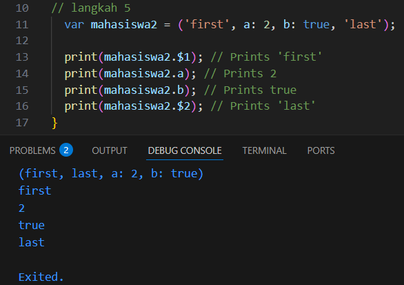

<p>ganti dengan nama dan NIM</p>
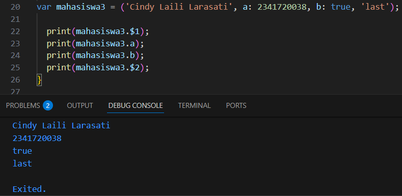

<hr>

<br><b>Tugas Praktikum</b><br>
<p>2. Jelaskan yang dimaksud Functions dalam bahasa Dart!</p>
<p>jawab:</p>
<p>Function adalah sekumpulan kode yang bisa dipanggil berulang-ulang untuk menjalankan tugas tertentu.</p>

<p>3. Jelaskan jenis-jenis parameter di Functions beserta contoh sintaksnya!</p>
<p>jawab:</p>
<p>- Positional Parameter (biasa): parameter urutannya harus sesuai.</p>

```
void buatProfil(String nama, int umur) {
  print("Nama: $nama");
  print("Umur: $umur tahun");
}

void main() {
  buatProfil("Cindy Laili Larasati", 20); 
}
```

<p>- Optional Positional Parameter: ditandai dengan [ ], bisa dikosongkan.</p>

```
void sapa([String? nama]) {
  print("Halo, ${nama ?? "Anonim"}");
}

void main() {
  sapa(); 
  sapa("Cindy"); 
}
```

<p>- Named Parameter: ditandai { }, dipanggil pakai nama, tidak tergantung urutan.</p>

```
void buatAkun({required String username, int umur = 18}) {
  print("Akun $username dibuat, umur: $umur");
}

void main() {
  buatAkun(username: "Cindy", umur: 20);
  buatAkun(username: "Laras"); 
}
```

<p>4. Jelaskan maksud Functions sebagai first-class objects beserta contoh sintaknya!</p>
<p>jawab:</p>
<p>Artinya function di Dart diperlakukan seperti "nilai" atau "objek". Bisa disimpan di variabel, bisa dikirim ke function lain, atau dikembalikan dari function.</p>

```
void cetakPesan(String pesan) {
  print(pesan);
}

void main() {
  var f = cetakPesan; // function disimpan di variabel
  f("Hai Cindy!");    // dipanggil lewat variabel
}
```

<p>5. Apa itu Anonymous Functions? Jelaskan dan berikan contohnya!</p>
<p>jawab:</p>
<p>Anonymous function adalah function tanpa nama. Biasanya dipakai sekali pakai, misalnya di forEach.</p>

```
void main() {
  var angka = [1, 2, 3];

  angka.forEach((n) {
    print(n * 2); // anonymous function
  });
}
```

<p>6. Jelaskan perbedaan Lexical scope dan Lexical closures! Berikan contohnya!</p>
<p>jawab:</p>
<p>- Lexical Scope: sebuah function bisa mengakses variabel di luar function sesuai letak kode (scope).</p>

```
void main() {
  var nama = "Cindy";

  void sapa() {
    print("Halo $nama"); // akses variabel luar
  }

  sapa();
}
```

<p>- Lexical Closure: function tidak hanya bisa mengakses variabel luar, tapi juga "mengikat" (menyimpan) nilainya meskipun scope asalnya sudah selesai.</p>

```
Function hitung() {
  int counter = 0;
  return () {
    counter++;
    return counter;
  };
}

void main() {
  var tambah = hitung();
  print(tambah()); // 1
  print(tambah()); // 2
  print(tambah()); // 3
}
```

<p>7. Jelaskan dengan contoh cara membuat return multiple value di Functions!</p>
<p>jawab:</p>
<p>Dart tidak bisa mengembalikan lebih dari satu nilai secara langsung, tapi bisa pakai List, Map, atau Record.</p>
<p>contoh pakai record:</p>

```
(int, int) hitung(int a, int b) {
  return (a + b, a - b);
}

void main() {
  var (tambah, kurang) = hitung(10, 5);
  print("Tambah: $tambah, Kurang: $kurang");
}
```