# Laporan Praktikum Pemrograman Mobile
# Pertemuan 5 Aplikasi Pertama dan Widget Dasar Flutter

<br><b>Nama : Cindy Laili Larasati<br>
<br>Nim : 2341720038<br>
<br>Kelas : TI - 3F</b><br>

<hr>

<br><b>Praktikum 1</b><br>
<p><b>Membuat Project Flutter Baru</b></p>

<p>Langkah 1:</p>
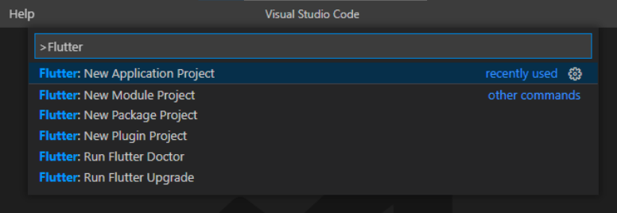

<p>Langkah 2:</p>
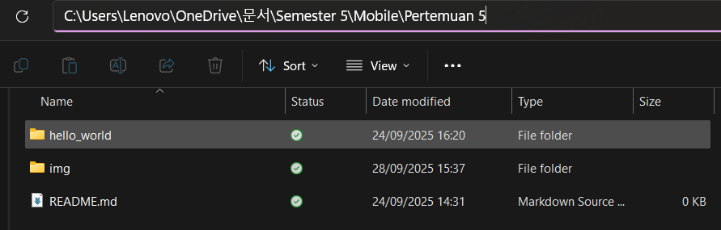

<p>Langkah 3:</p>
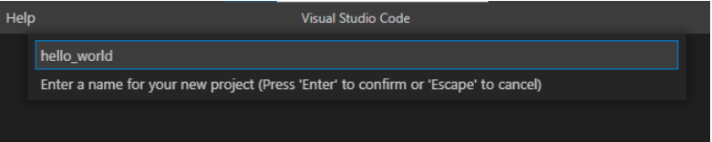

<p>Langkah 4:</p>
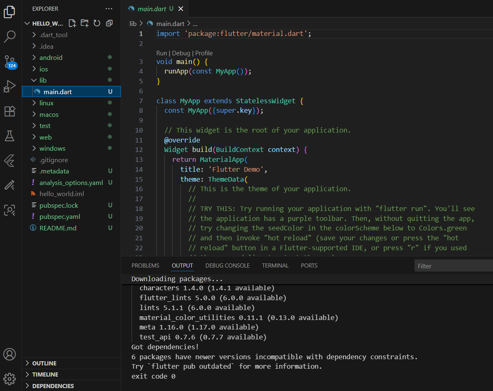

<hr>

<br><b>Praktikum 2</b><br>
<p><b>Menghubungkan Perangkat Android atau Emulator</b></p>
<p>Langkah 4:</p>
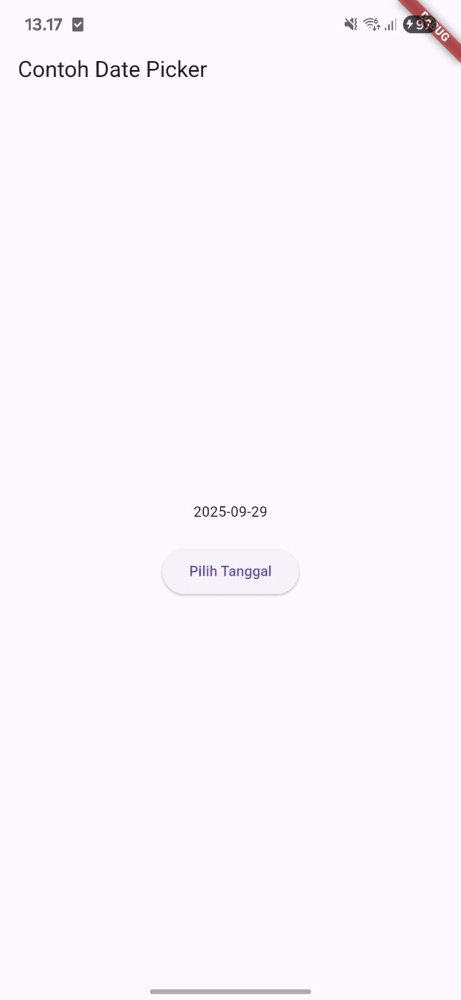

<hr>

<br><b>Praktikum 3</b><br>
<p><b>Membuat Repository GitHub dan Laporan Praktikum</b></p>

<p>Langkah 11:</p>
<p>Kembali ke VS Code, ubah platform di pojok kanan bawah ke emulator atau device atau bisa juga menggunakan browser Chrome. Lalu coba running project hello_world dengan tekan F5 atau Run > Start Debugging. Tunggu proses kompilasi hingga selesai, maka aplikasi flutter pertama Anda akan tampil seperti berikut.</p>
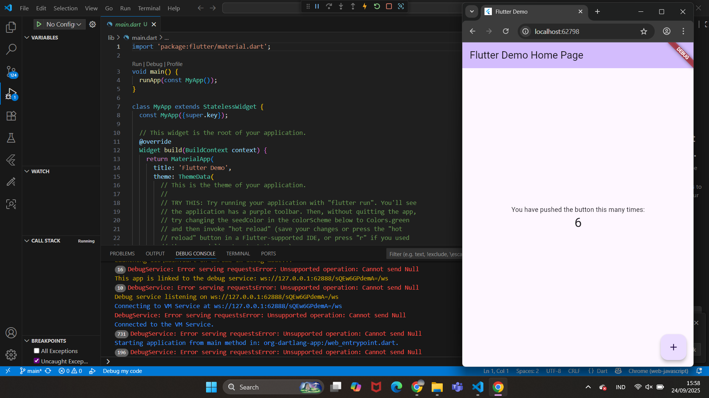

<p>Langkah 12:</p>
<p>Silakan screenshot seperti pada Langkah 11, namun teks yang ditampilkan dalam aplikasi berupa nama lengkap Anda. Simpan file screenshot dengan nama 01.png pada folder images (buat folder baru jika belum ada) di project hello_world Anda. Lalu ubah isi README.md seperti berikut, sehingga tampil hasil screenshot pada file README.md. Kemudian push ke repository Anda.</p>
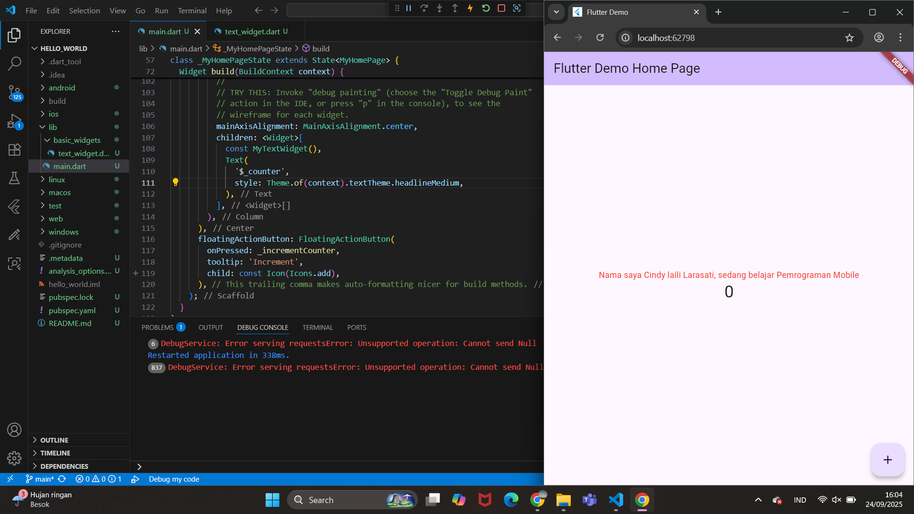

<hr>

<br><b>Praktikum 4</b><br>
<p><b>Menerapkan Widget Dasar</b></p>

<p>Langkah 1:</p>
<p>Buat folder baru basic_widgets di dalam folder lib. Kemudian buat file baru di dalam basic_widgets dengan nama text_widget.dart. Ketik atau salin kode program berikut ke project hello_world Anda pada file text_widget.dart.</p>


<p>Lakukan import file text_widget.dart ke main.dart, lalu ganti bagian text widget dengan kode di atas. Maka hasilnya seperti gambar berikut. Screenshot hasil milik Anda, lalu dibuat laporan pada file README.md.</p>


<p>Langkah 2:</p>
<p>Buat sebuah file image_widget.dart di dalam folder basic_widgets dengan isi kode berikut.</p>
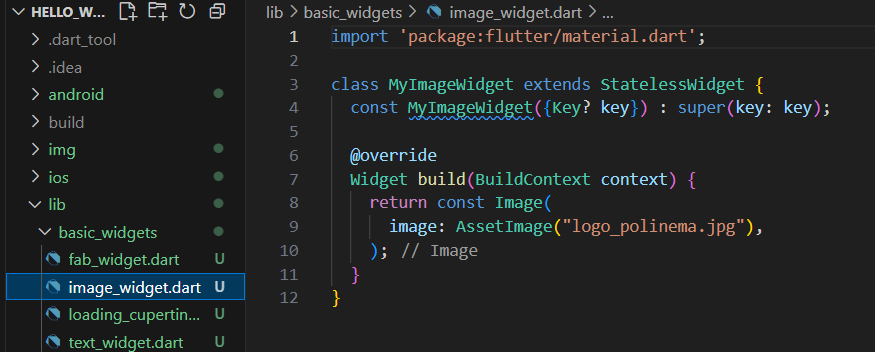

<p>Lakukan penyesuaian asset pada file pubspec.yaml dan tambahkan file logo Anda di folder assets project hello_world.</p>

```
flutter:
  assets:
     - logo_polinema.jpg
```

<p>Jangan lupa sesuaikan kode dan import di file main.dart kemudian akan tampil gambar seperti berikut.</p>
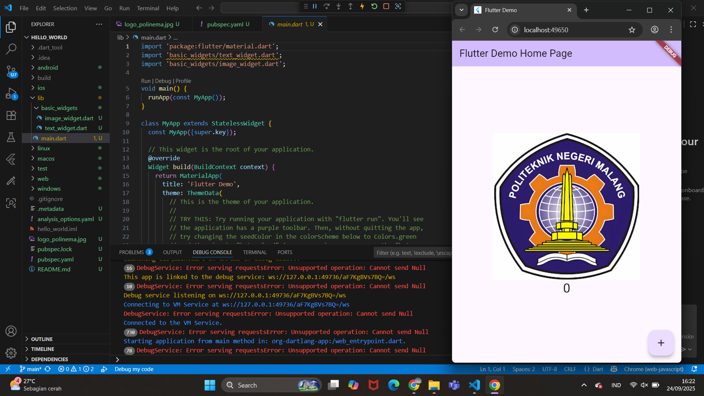

<hr>

<br><b>Praktikum 5</b><br>
<p><b>Menerapkan Widget Material Design dan iOS Cupertino</b></p>

<p>Langkah 1: Cupertino Button dan Loading Bar</p>
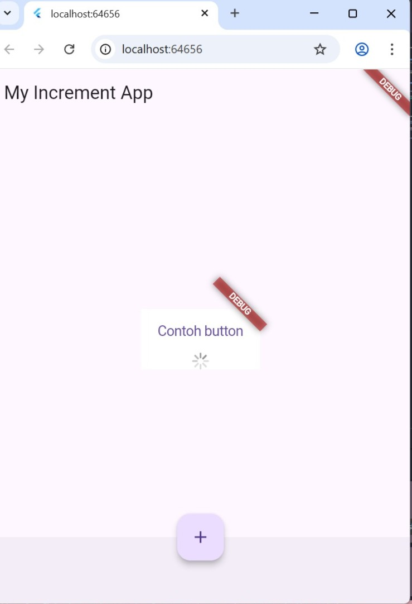

<p>Langkah 2: Floating Action Button (FAB)</p>
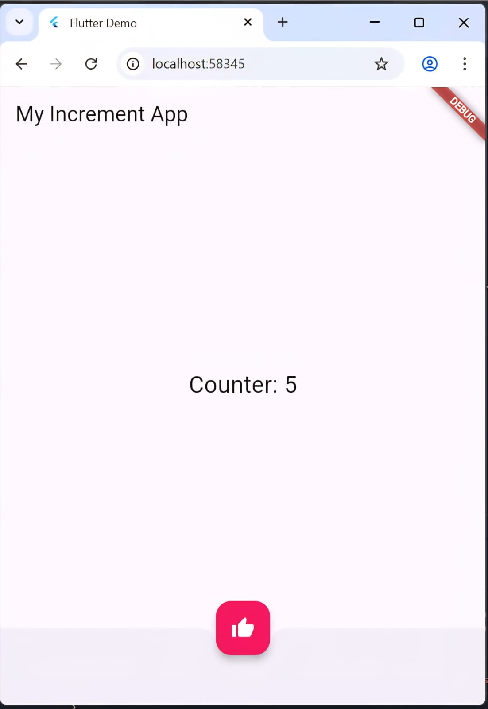

<p>Langkah 3: Scaffold Widget</p>
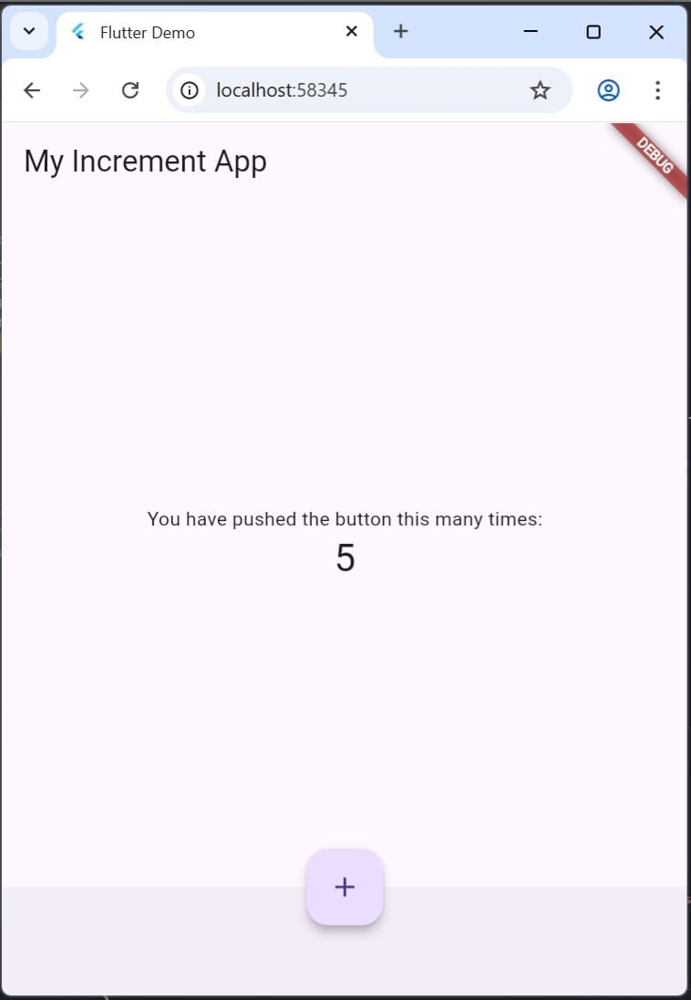

<p>Langkah 4: Dialog Widget</p>
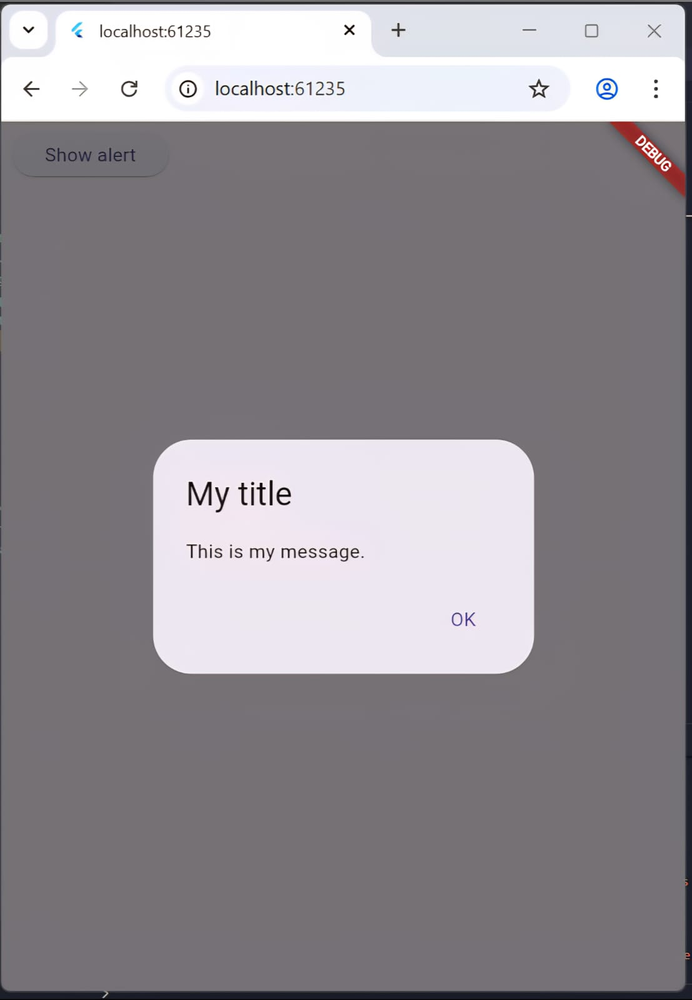

<p>Langkah 5: Input dan Selection Widget</p>
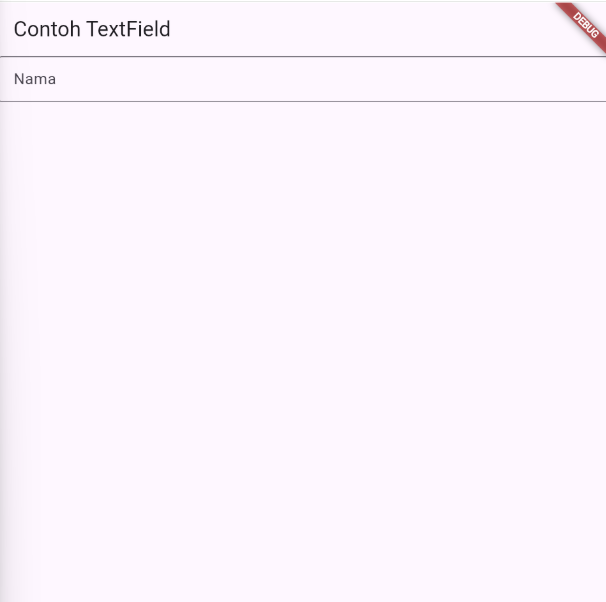

<p>Langkah 6: Date and Time Pickers</p>
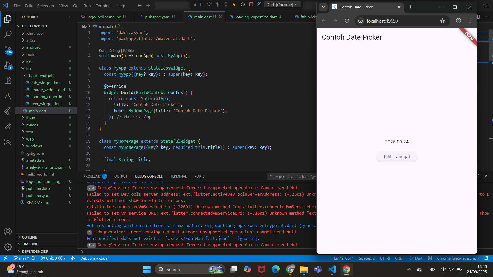