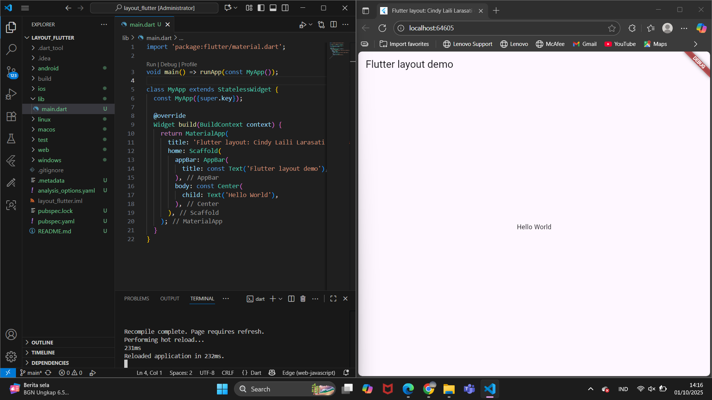
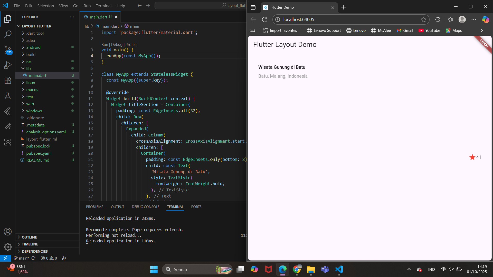
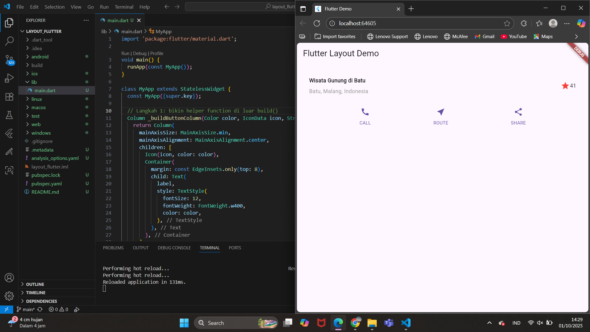
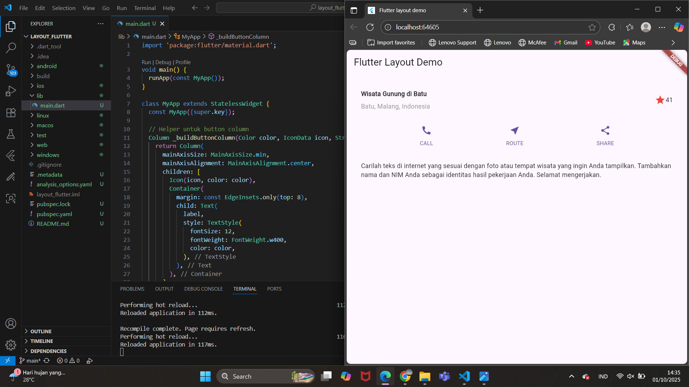
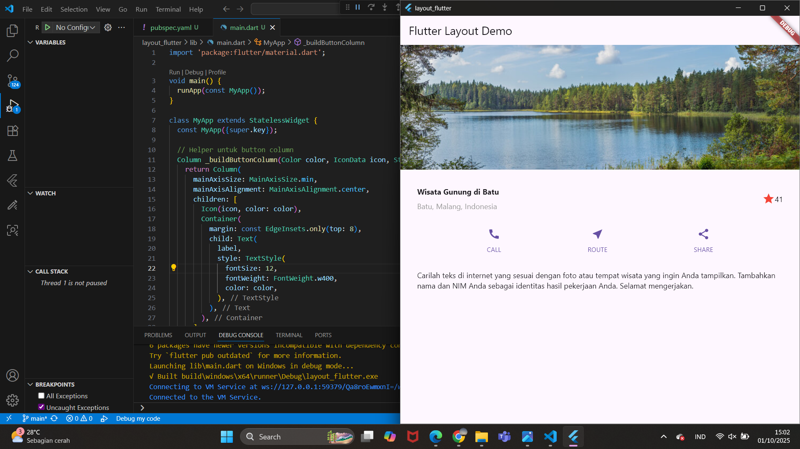
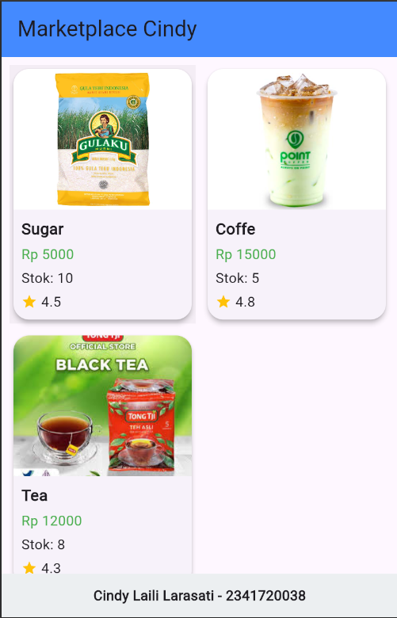

# Laporan Praktikum Pemrograman Mobile
# Pertemuan 6 Layout dan Navigasi

 <b>Nama : Cindy Laili Larasati 
 Nim : 2341720038 
 Kelas : TI - 3F</b> 

 <b>Praktikum 1</b> 

<b>Membangun Layout di Flutter</b>

Langkah 1:

Hasil Akhir:

 <b>Praktikum 2</b> 

<b>Implementasi button row</b>

Hasil Akhir:

 <b>Praktikum 3</b> 

<b>Implementasi text section</b>

Hasil Akhir:

 <b>Praktikum 4</b> 

<b>Implementasi image section</b>

Hasil Akhir:

 <b>Tugas Praktikum 1</b> 

Silakan implementasikan di project baru "basic_layout_flutter" dengan mengakses sumber ini: https://docs.flutter.dev/codelabs/layout-basics

Hasil Akhir:

 <b>Praktikum 5</b> 

<b>Membangun Navigasi di Flutter</b>

Hasil Akhir:

 <b>Tugas Praktikum 2</b> 

Silakan implementasikan di project baru "basic_layout_flutter" dengan mengakses sumber ini: https://docs.flutter.dev/codelabs/layout-basics

Hasil Akhir:

