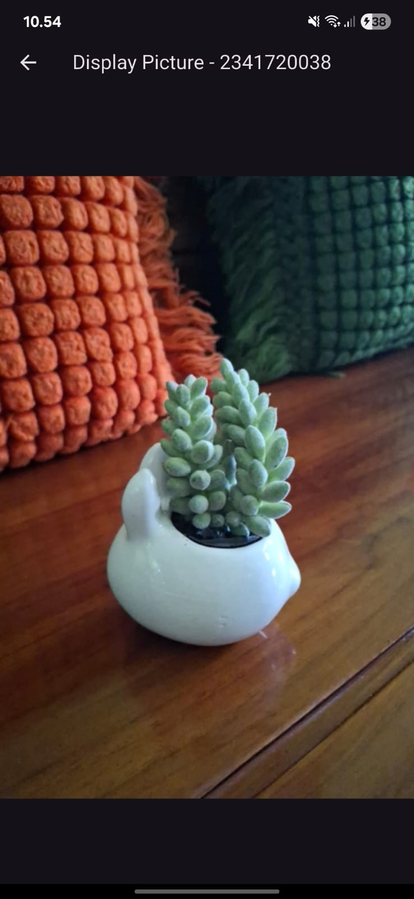

# Laporan Praktikum Pemrograman Mobile
# Pertemuan 9 Kamera di Flutter

 <b>Nama : Cindy Laili Larasati 
 Nim : 2341720038 
 Kelas : TI - 3F</b> 

 <b>Praktikum 1</b> 

<b>Mengambil Foto dengan Kamera di Flutter</b>

Hasil:

 <b>Praktikum 2</b> 

<b>Membuat photo filter carousel</b>

Hasil:

 <b>Tugas Praktikum</b> 

2. Gabungkan hasil praktikum 1 dengan hasil praktikum 2 sehingga setelah melakukan pengambilan foto, dapat dibuat filter carouselnya!

Hasil:

3. Jelaskan maksud void async pada praktikum 1

jawab: async dipakai untuk membuat fungsi yang bersifat asynchronous, yaitu fungsi yang bisa menjalankan proses secara tidak langsung sambil menunggu hasilnya dengan bantuan await.

4. Jelaskan fungsi dari anotasi @immutable dan @override ?

jawab: Anotasi @immutable menunjukkan bahwa suatu class tidak bisa diubah setelah dibuat, sedangkan @override digunakan untuk mengganti atau menyesuaikan method yang berasal dari class induknya.

