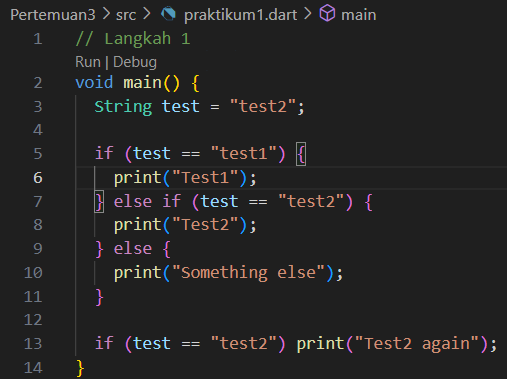
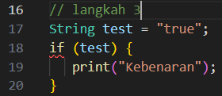
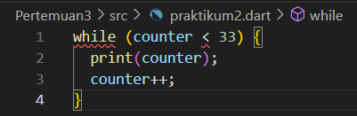
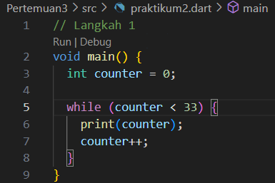

# Laporan Praktikum Pemrograman Mobile
# Pertemuan 3 Conditional and Loop

 <b>Nama : Cindy Laili Larasati 
 Nim : 2341720038 
 Kelas : TI - 3F</b> 

 <b>Praktikum 1</b> 

<b>Menerapkan Control Flows ("if/else")</b>

Langkah 2:

jawab:

Ketika saya menjalankan kode tersebut, program langsung error karena ada kesalahan penulisan sintaks. Kata kunci else If dan Else ditulis dengan huruf besar, padahal Dart bersifat case-sensitive, sehingga harus ditulis else if dan else. Akibatnya, program tidak bisa dikompilasi dan tidak menampilkan output apapun.

Langkah 3:

jawab:

Yang terjadi adalah error karena menuliskan if (test) padahal variabel test bertipe String. Di Dart, kondisi if hanya boleh berupa nilai boolean (true atau false), jadi tidak bisa langsung memakai string.

 <b>Praktikum 2</b> 

<b>Menerapkan Perulangan "while" dan "do-while"</b>

Langkah 2:

jawab:

Ketika saya menjalankan kode tersebut, terjadi error karena variabel counter belum saya deklarasikan ataupun diberi nilai terlebih dahulu. Akibatnya program tidak mengenali counter saat digunakan di dalam perulangan while.

Langkah 3:

jawab:

Ketika saya menjalankan kode tersebut, terjadi error karena variabel counter belum saya deklarasikan ataupun diberi nilai terlebih dahulu. Akibatnya program tidak mengenali counter saat digunakan di dalam perulangan do-while.

 <b>Praktikum 3</b> 

<b>Menerapkan Perulangan "for" dan "break-continue"</b>

Langkah 2:

jawab:

Ketika saya menjalankan kode tersebut, terjadi error karena ada beberapa masalah. Pertama, variabel Index dan index ditulis dengan huruf besar dan kecil yang berbeda sehingga dianggap dua variabel berbeda, padahal belum ada satupun yang dideklarasikan. Kedua, di dalam perulangan for tidak menuliskan index++ pada bagian increment, sehingga sintaks tidak lengkap.

Langkah 3:

jawab:

Ketika saya menjalankan kode tersebut, terjadi error karena ada beberapa hal yang salah. Pertama, penulisan kata kunci If dan Else If menggunakan huruf besar, padahal di Dart harus ditulis dengan huruf kecil (if dan else if). Kedua, variabel Index ditulis berbeda dengan index, sehingga dianggap sebagai dua variabel yang berbeda padahal seharusnya sama.

 <b>Tugas Praktikum</b> 

Buatlah sebuah program yang dapat menampilkan bilangan prima dari angka 0 sampai 201 menggunakan Dart. Ketika bilangan prima ditemukan, maka tampilkan nama lengkap dan NIM Anda.

