# Laporan Praktikum Pemrograman Mobile
# Pertemuan 3 Conditional and Loop

<br><b>Nama : Cindy Laili Larasati<br>
<br>Nim : 2341720038<br>
<br>Kelas : TI - 3F</b><br>

<hr>

<br><b>Praktikum 1</b><br>
<p><b>Menerapkan Control Flows ("if/else")</b></p>

<p>Langkah 2:</p>
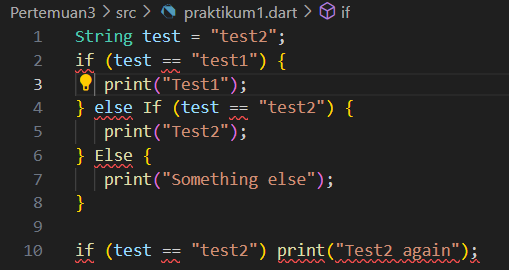
<p>jawab:</p>
<p>Ketika saya menjalankan kode tersebut, program langsung error karena ada kesalahan penulisan sintaks. Kata kunci else If dan Else ditulis dengan huruf besar, padahal Dart bersifat case-sensitive, sehingga harus ditulis else if dan else. Akibatnya, program tidak bisa dikompilasi dan tidak menampilkan output apapun.</p>

<p>setelah diperbaiki:</p>
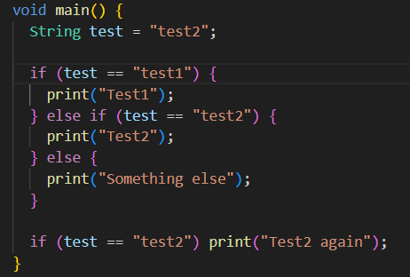

<p>kerika dijalankan:</p>
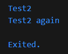

<hr>

<p>Langkah 3:</p>

```
String test = "true";
if (test) {
   print("Kebenaran");
}
```
<p>terjadi error karena if seharusnya menerima nilai bertipe boolean, sedangkan yang ditulis masih berupa string "true".</p>

<p>setelah diperbaiki:</p>
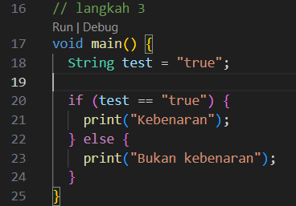

<p>ketika di jalankan:</p>
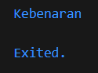

<hr>

<br><b>Praktikum 2</b><br>
<p><b>Menerapkan Perulangan "while" dan "do-while"</b></p>

<p>Langkah 2:</p>

```
while (counter < 33) {
    print(counter);
    counter++;
  }
```

<p>ketika dijalankan akan muncul angka 0 sampai 32</p>
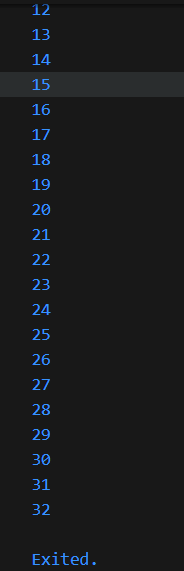

<hr>

<p>Langkah 3:</p>
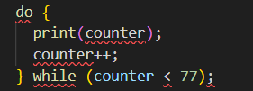
<p>jawab:</p>
<p>Ketika saya menjalankan kode tersebut, terjadi error karena variabel counter belum saya deklarasikan ataupun diberi nilai terlebih dahulu. Akibatnya program tidak mengenali counter saat digunakan di dalam perulangan do-while.</p>

<p>setelah diperbaiki:</p>
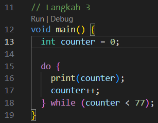

<p>ketika dijalankan akan muncul angka 0 sampai 76</p>
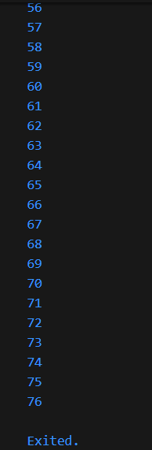

<hr>

<br><b>Praktikum 3</b><br>
<p><b>Menerapkan Perulangan "for" dan "break-continue"</b></p>

<p>Langkah 2:</p>
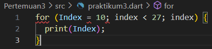
<p>Kode tersebut akan menghasilkan error karena penulisan variabel Index dan index berbeda (Dart membedakan huruf besar dan kecil). Selain itu, pada bagian perulangan tidak ada proses penambahan nilai sehingga tidak dapat berjalan sebagaimana mestinya.</p>

<p>setelah diperbaiki:</p>
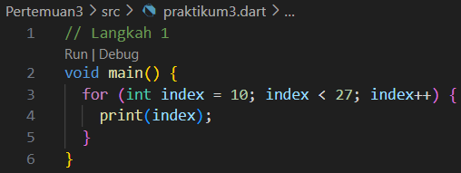

<p>ketika dijalankan:</p>
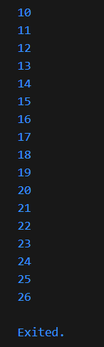

<hr>

<p>Langkah 3:</p>
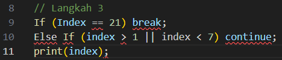
<p>Kode tersebut akan error karena penulisan If dan Else If seharusnya menggunakan huruf kecil. selain itu, variabel Index ditulis berbeda dengan index, sehingga dianggap sebagai dua variabel yang berbeda padahal seharusnya sama.</p>

<p>setelah diperbaiki:</p>
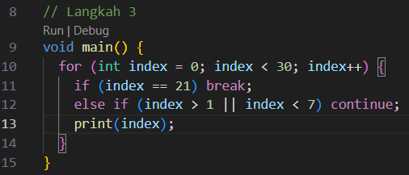

<p>ketika di jalankan:</p>
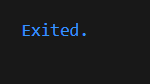

<br><b>Tugas Praktikum</b><br>
<p>Buatlah sebuah program yang dapat menampilkan bilangan prima dari angka 0 sampai 201 menggunakan Dart. Ketika bilangan prima ditemukan, maka tampilkan nama lengkap dan NIM Anda.</p>
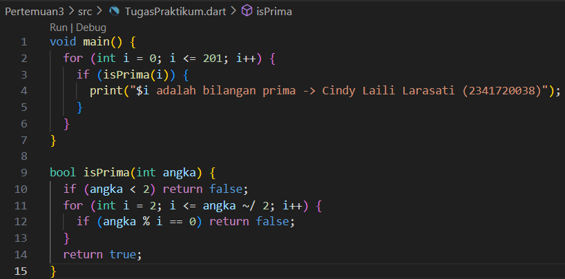
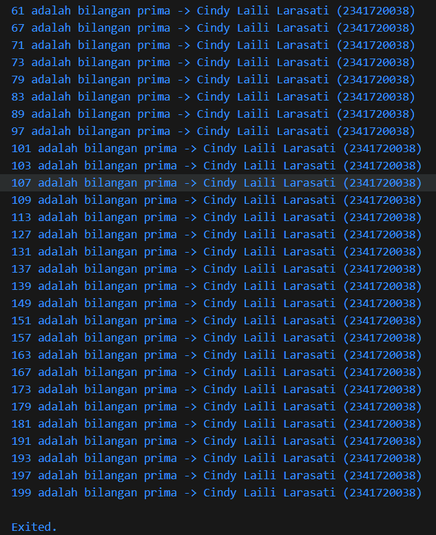